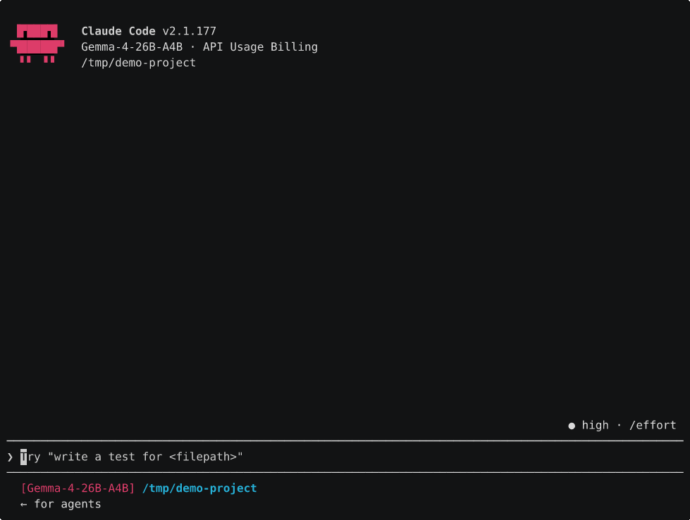

# V100 LLM Kit

Run capable LLMs fully locally on a Tesla V100-SXM2-16GB. Prebuilt binaries, serve scripts,
and step-by-step setup for both Windows and Linux, plus how to point Claude Code and OpenClaw
at the box so your coding agent and your assistant run entirely on your own hardware.

The V100 is a 2017 datacentre card you can pick up cheap now, 16 GB of HBM2 at ~900 GB/s. That
memory bandwidth is what matters for token generation, and it's still pretty good. The catch is
it's Volta (compute 7.0, fp16 only, no bf16 or int8 tensor cores), so a fair bit of modern
quant advice doesn't apply. This kit is tuned around what the card can actually do.

> **Hardware scope:** binaries here are built for **SM_70 (Volta / V100) only**. They won't run
> on other GPUs without a rebuild. If you bought a card from me, these are the ones for you.

## What you get

Two inference engines, because two model shapes need different things:

| Model | Engine | Why | Fits |
|---|---|---|---|
| **Gemma 4 26B-A4B** (QAT Q4_0) | upstream llama.cpp | needs sliding-window-attention KV compression | entirely in 16 GB, pure GPU |
| **Qwen3.6 35B-A3B** (IQ4_XS) | ik_llama.cpp | MoE expert offload + faster CPU GEMM | GPU + a bit of CPU RAM |

Gemma 4 is the easy one, it's all on the GPU so it's fast and simple. Qwen3 is the bigger,
stronger model but it offloads some experts to CPU RAM, so it's a touch slower and wants a
decent CPU. Pick whichever suits, the kit serves both.

## Quick start

1. **Driver:** get the card into MCDM mode (see [docs/01-hardware.md](docs/01-hardware.md)).
   On Linux native you can skip this.
2. **Grab the binaries** for your OS from [Releases](../../releases), extract somewhere.
3. **Pull a model:** `scripts/<os>/download-models.*` (needs a free Hugging Face account).
4. **Serve it:** `scripts/<os>/serve-gemma4.*` or `serve-qwen3.*`.
5. **Use it:** OpenAI-compatible API at `http://localhost:8011` (Gemma) or `:8001` (Qwen).
   Wire up [Claude Code](docs/05-claude-code.md) or [OpenClaw](docs/06-openclaw.md).

## Docs

- [01 — Hardware & driver setup](docs/01-hardware.md)
- [02 — Linux / WSL2 setup](docs/02-linux-setup.md)
- [03 — Windows native setup](docs/03-windows-setup.md)
- [04 — Models: which, how to pull, sizing](docs/04-models.md)
- [05 — Claude Code, fully local](docs/05-claude-code.md)
- [06 — OpenClaw, fully local](docs/06-openclaw.md)
- [Benchmarks](docs/benchmarks.md)

## See it running

Ask either model what it is and it tells you the truth, because it's running on your card, not
Anthropic's:

Claude Code pointed at the local server, doing real work (listing a project and summarising it).
Note the model name in the status bar, the whole agent loop runs on the V100:

These play at real speed (no speed-up), only dead air between turns is trimmed.

## How fast is it, honestly

Token generation lands around 28-37 tok/s on Qwen3 and ~47-57 tok/s on Gemma 4 depending on
context and OS. That's comfortably usable for chat and for Claude Code, slower than a frontier
API but it's running on a card in your cupboard with nothing leaving the machine. Windows native
is measurably quicker than WSL2 for generation (the virtualisation layer taxes the
memory-bound decode path), numbers in [docs/benchmarks.md](docs/benchmarks.md).

One thing worth knowing for Claude Code: it sends a big (~24k token) system prompt, and the
server caches it after the first turn (RAM prompt cache, `-cram`). So you pay the prompt
processing once as a cold start, then every turn after restores it from cache and only
processes your new message. Measured per turn:

| | Cold first turn | Warm turns (cached) |
|---|---|---|
| Gemma 4 | ~15s | ~2.5s |
| Qwen3 | ~2.5 min | ~4.5s |

Warm turns are quick on both. The difference is the cold start: Gemma processes that 24k
prompt in ~12s (pure GPU), Qwen takes ~2.5 min because its MoE expert-offload makes
long-prompt processing much slower. So Gemma's the nicer Claude Code experience, mostly
because of the gentle cold start. Add a longer reply and the warm turn grows by the generation
time on top.

## License

MIT. The bundled engines (llama.cpp, ik_llama.cpp) keep their own upstream licenses.
