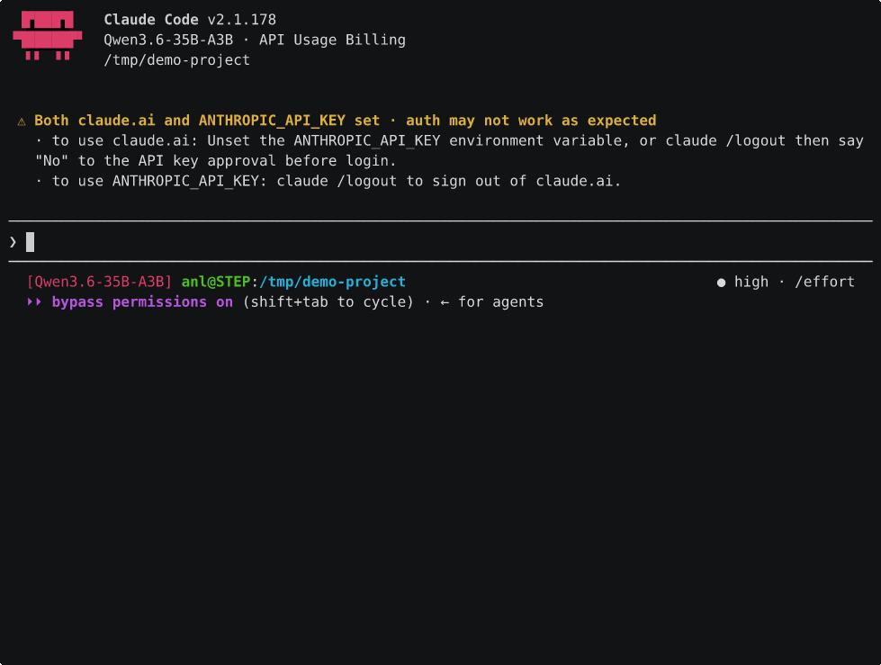

# 07, Dual V100 + NVLink (multi-agent serving)

Two V100s on one PCIe card with an NVLink bridge, for **concurrent / multi-agent serving** on
Windows. The win comes from running the model tensor-parallel across both cards with NCCL driving
the all-reduce over NVLink. Under concurrency this gives **~7–9% more aggregate throughput**
(~30–37% faster prompt processing, decode about flat) than the Windows default, numbers in
[benchmarks.md](benchmarks.md#dual-v100--nvlink--multi-agent-nccl-all-reduce).

> **When to use this.** Multi-agent / high-concurrency, or a model too big for one 16 GB card
> (e.g. Qwen3.6 35B fully resident). For a *single* stream of a model that fits one card, one card
> is faster, don't split it.

The second case is worth spelling out, it's a single-stream win, not a concurrency one. On a single
card Qwen3.6 35B has to offload experts to CPU RAM (the IQ4_XS weights are ~18 GB), which is what
makes its Claude Code cold start so slow, ~2.5 min to process the ~24k-token system prompt. Split it
across both cards with `-sm layer` and it sits entirely in VRAM, no offload, and that cold start
drops to **~13s** (warm turns ~1s). Same project tour as the single-card README gif, on the dual card:



No NCCL needed for this, `-sm layer` is a pipeline split with no per-layer all-reduce (NCCL only
matters for the `-sm tensor` concurrency path below). Measured with upstream llama.cpp, both GPUs
visible, `-sm layer -ts 1/1 -ngl 99 -fa on -c 32768` and q8_0 KV, the rest as `serve-qwen3.bat`.

## 1. Hardware / driver

- The dual card needs the x16 slot set to **PCIe bifurcation x8/x8** in BIOS (+ Above 4G Decoding).
- Put both GPUs in **TCC** (compute) mode, best for GPU↔GPU P2P, and all serving here is
  native-Windows so WSL2 (which needs MCDM) isn't required:
  ```
  nvidia-smi -i 0 -dm 1
  nvidia-smi -i 1 -dm 1   (then reboot)
  ```
- Confirm the bridge is up and P2P works:
  ```
  nvidia-smi nvlink --status          (expect active links, ~25 GB/s each)
  ```
  A direct `cudaMemcpyPeer` test measures ~33 GB/s GPU↔GPU here, well above the x8 PCIe link.

## 2. Build NCCL for Windows (sm_70)

NVIDIA ships no Windows NCCL; use the community port. From an x64 VS dev prompt with CUDA 12.8:
```bat
git clone --branch nccl-windows https://github.com/SystemPanic/nccl-windows.git
cd nccl-windows
cmake -S . -B build -G Ninja -DCMAKE_BUILD_TYPE=Release -DCMAKE_CUDA_ARCHITECTURES=70 -DCMAKE_INSTALL_PREFIX=install
cmake --build build --parallel --target install
```
Output: `install\bin\nccl.dll`, `install\lib\nccl.lib`, `install\include\nccl.h`.

## 3. Build llama.cpp with NCCL

`GGML_CUDA_NCCL` defaults ON but needs NCCL found at configure time. Point it at the install dir.
Including `nccl.h` pulls in `winsock.h`, which clashes with ggml's `winsock2.h`, define
`WIN32_LEAN_AND_MEAN` + `_WINSOCKAPI_` to fix it:
```bat
cmake -S . -B build -DCMAKE_BUILD_TYPE=Release -DCMAKE_CUDA_ARCHITECTURES=70 ^
  -DGGML_CUDA=ON -DGGML_CUDA_FA=ON -DGGML_CUDA_NCCL=ON ^
  -DNCCL_ROOT=C:\path\to\nccl-windows\install ^
  -DCMAKE_CUDA_FLAGS="-DWIN32_LEAN_AND_MEAN -D_WINSOCKAPI_" ^
  -DCMAKE_CXX_FLAGS="-DWIN32_LEAN_AND_MEAN -D_WINSOCKAPI_"
cmake --build build --parallel --target llama-server --target llama-bench
```
Configure must report `-- Found NCCL: ...nccl.lib`. Then **copy `nccl.dll` next to the llama
binaries** (it's loaded from the exe directory at runtime). The prebuilt dual-card release ships
these binaries + `nccl.dll` already.

## 4. Serve

```bat
scripts\windows\serve-dual-nccl.bat
:: defaults: Qwen3.6 35B, -sm tensor across both cards, GGML_CUDA_ALLREDUCE=nccl, 8 parallel slots
set PARALLEL=16 & set CTX=32768 & serve-dual-nccl.bat
set ALLREDUCE=internal & serve-dual-nccl.bat   (A/B against the non-NCCL default)
```
Key knobs the script sets: `-sm tensor -ts 1/1` (tensor-parallel, even split),
`GGML_CUDA_ALLREDUCE=nccl`, `--parallel N --cont-batching` (the concurrency that makes NVLink pay).

## 5. End-to-end serving numbers

Real concurrent clients against `llama-server` (Qwen3.6 35B, `-sm tensor`, `--parallel 16`,
128-token replies, fresh prompt per request, i.e. a harsh, prefill-heavy diverse-agent workload):

| server all-reduce | 16-way aggregate decode | p50 latency | p95 |
|---|---|---|---|
| internal (Windows default) | 143 tok/s | 14.5 s | 17.5 s |
| **NCCL + NVLink** | **174 tok/s** | **11.9 s** | **14.5 s** |

NCCL+NVLink is **+22% throughput and ~18% lower latency** end-to-end. Throughput scales ~3.7×
from 1→16 concurrent (47 → 122 → 155 → 174 tok/s at 1/4/8/16). (These are lower than the
synthetic `llama-batched-bench` figures above because each request re-prefills its prompt and
competes with decode, batched-bench measures pure lock-step TG.)

> Caveat: this real-server table predates the chassis-fan fix and was *not* re-measured in the
> back-to-back pass that revised the batched-bench numbers above. Its `internal` baseline may have
> been throttling, same as the old batched figures, so the +22% likely overstates the gap. It's a
> prefill-heavy workload, so NCCL's prompt-processing win does carry more weight here than in the
> mixed batched-bench aggregate, but treat the exact figure as indicative until re-run. **TODO: re-measure.**

## 6. Gotchas

- **`nccl.dll` must be beside `llama-server.exe`** (or on PATH), else NCCL silently can't load and
  it falls back to the `internal` all-reduce.
- **Verify NCCL is actually used:** run once with `set NCCL_DEBUG=INFO`, you want
  `... via P2P/direct pointer` in the log (NVLink). If you see socket/host transport, P2P didn't engage.
- **Bootstrap interface:** NCCL's one-time rendezvous may pick a VPN/Tailscale adapter if the
  hostname resolves there. Harmless for throughput (data still goes over NVLink P2P), but pin
  `NCCL_SOCKET_IFNAME` to your LAN adapter (e.g. `Ethernet`) to avoid a stall if the VPN is down.
  The serve script defaults it to `Ethernet`.
- This path is **llama.cpp only** here. vLLM (the stronger throughput engine) builds on Windows for
  sm_70 but its runtime is blocked by torch's Windows gloo; NVLink-TP via vLLM is a Linux capability.
