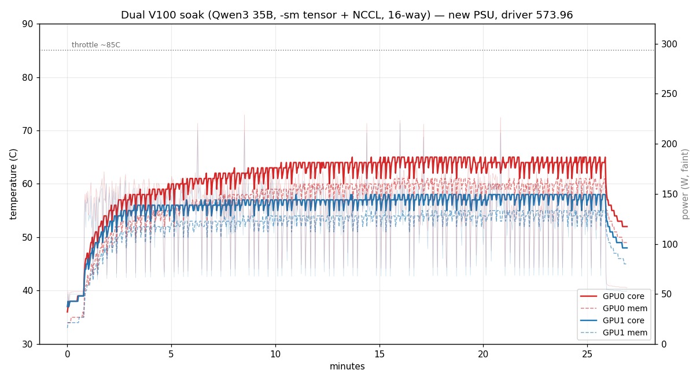
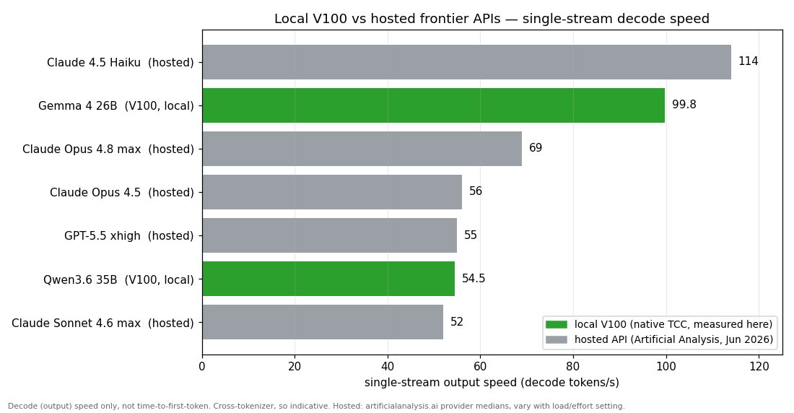

# Benchmarks

All measured on a Tesla V100-SXM2-16GB + Ryzen 9 3900X (Zen 2, 12C/24T, DDR4). `llama-bench`,
q8_0 KV cache, flash attention on. The single-card tables cover both Windows driver modes: **TCC**
(the recommended native path) and **MCDM** (what WSL2 needs). Your CPU and RAM speed will shift the
Qwen3 numbers (it does CPU expert compute); Gemma 4 is pure-GPU so it's mostly CPU-independent.

## Single V100

### Gemma 4 26B-A4B QAT Q4_0, upstream llama.cpp (commit 02182fc)

`-ngl 99 -fa 1 -ctk q8_0 -ctv q8_0 -t 6 -p 512 -n 128`

| Test | Windows TCC | Windows MCDM | WSL2 | CPU-only |
|---|---|---|---|---|
| pp512 | 2023 t/s | 1982 t/s | 2048 t/s | 69.7 t/s |
| tg128 | **99.8 t/s** | 56.8 t/s | 47.0 t/s | 13.1 t/s |

### Qwen3.6 35B-A3B IQ4_XS, ik_llama.cpp (commit 022bd00a)

`-ngl 99 --fit 1 --fit-margin 1664 -fa 1 -ctk q8_0 -ctv q8_0 -ub 2048 -t 12 -p 512 -n 128`

| Test | Windows TCC | Windows MCDM | WSL2 |
|---|---|---|---|
| pp512 | 542 t/s | 460.9 t/s | 441.3 t/s |
| tg128 | **54.5 t/s** | 37.7 t/s | 26.3 t/s |

## Windows native vs WSL2

PP is within noise across modes. TG is where it matters, and the recommended native-Windows **TCC**
mode is fastest by a wide margin: Gemma 4 **99.8 tok/s** vs 56.8 in MCDM (+76%), Qwen3 **54.5** vs
37.7 (+45%), same build, same q8_0 KV, same flags, the driver mode the only difference. TCC drops
the WDDM/MCDM per-kernel-launch overhead that taxes the launch-heavy decode loop. MCDM (the mode
WSL2 needs) is slower, and running under WSL2 on top of MCDM adds a little more GPU-PV latency,
Qwen3 pays most because its MoE expert offload makes frequent GPU↔CPU syncs that each wear the tax.
So run native TCC for speed, use MCDM / WSL2 only if you want the Linux tooling.

## Notes on the knobs

- **Threads:** Gemma 4 wants `-t 6` not `-t 12`, fully GPU-resident, so extra threads only add
  scheduling overhead (~11% better TG at 6). Qwen3 wants `-t 12` because it actually uses the
  cores for expert compute.
- **Batch size:** `-ub 2048` roughly doubles Qwen3 prompt processing vs the 512 default, for a
  ~2 GB compute buffer that's safe at any context. `-ub 4096` gets ~3x PP but evicts too many
  experts at high context. Gemma 4 likes `-ub 1024`.
- **Context size:** bigger `-c` reserves more KV up front. On Qwen3 that pushes more experts to
  CPU and slows every turn, so size it for what you actually use.

## Dual V100 + NVLink

Two V100s on a single PCIe card (slot bifurcated x8/x8) with a 2-link NVLink bridge
(~51 GB/s). Numbers below are a **separate, self-consistent set**, current build, `llama-bench`,
**f16 KV**, `-ts 1/1`, **TCC driver mode**. Don't cross-compare them with the single-card tables
above: those are a different commit, q8_0 KV, and MCDM mode. (Cross-comparing across driver mode
/ KV type is exactly how you fool yourself here, see the TCC note below.)

### The three multi-GPU modes

llama.cpp has three `--split-mode` options and they behave very differently on this hardware:

- **`row` (old tensor-parallel): doesn't work here.** Crashes at load for every model we ship,
  MoE expert tensors (Gemma 4, Qwen3 35B) and the Qwen3 27B hybrid's gate/conv tensors all trip
  the same `ggml_backend_cuda_split_buffer_set_tensor` "invalid argument" copy. It's deprecated and
  dense-2D-only. Don't use it.
- **`layer` (pipeline): the model is split across both cards, one card active at a time per token.**
  No decode speed-up from the second card, but it parallelises prompt processing well, and it lets
  you hold a model + KV that a single 16 GB card can't.
- **`tensor` (newer tensor-parallel): both cards compute each token together.** Works on MoE here
  (despite some upstream notes to the contrary). Helps *dense* models, hurts prompt processing.

### Token generation (tok/s), dual-card, by mode

| Model | single card | `layer` | `tensor` | use |
|---|---|---|---|---|
| Gemma 4 26B-A4B (fits one card) | **99.0** | 90.4 | 76.0 | one card is fastest, don't split |
| Qwen3.6 35B-A3B (needs two) | won't fit | **82.8** | 60.8 | `layer` |
| Qwen3.6 27B dense (needs two) | no KV room | 32.4 | **39.4** | `tensor` |

Prompt processing (pp2048, tok/s): Gemma 2055 / 3055 / 1060, Qwen3 35B, / 2333 / 1257,
Qwen3 27B 822 / 822 / 384 for single / layer / tensor. `tensor` consistently trades PP for TG.

**What actually helps:**
- For a model that **fits on one card** (Gemma 4), a single card gives the best decode, splitting
  only adds overhead. The second card does nothing useful for it.
- For **MoE that needs two cards** (Qwen3 35B), use **`layer`**: 82.8 tok/s fully resident, far
  better than the old single-card-with-CPU-offload path, and it holds long context (loaded 131k
  with q8_0 KV, ~11 GB/card; the model trains to 262k).
- **`tensor` only wins for the dense/hybrid 27B** (+~22% TG): a dense model genuinely splits its
  per-token matmuls across both GPUs. MoE doesn't benefit, the experts pipeline better than they
  tensor-split.

### Does NVLink do anything?

**For single-stream: no. For multi-agent (concurrent): yes, mostly on prompt processing.** Single-stream `tensor` mode
moves too little per token to notice, forcing copies off the bridge (`GGML_CUDA_NO_PEER_COPY=1`)
left TG unchanged (39.44 → 39.07 tok/s). But P2P over NVLink *does* work on Windows (TCC): a direct
`cudaMemcpyPeer` test measures **33 GB/s** GPU↔GPU (vs ~8–13 for the x8 PCIe link). Under concurrent
load the batched all-reduce gets large enough that the bridge matters, see the multi-agent section.

### Dual V100 + NVLink, multi-agent (NCCL all-reduce)

This is the configuration to use for concurrent / multi-agent serving on Windows. llama.cpp's
`-sm tensor` picks its all-reduce backend via `GGML_CUDA_ALLREDUCE` (`nccl` | `internal` | `none`);
the **default on Windows is `internal`** (a built-in P2P pipeline), NCCL only by default on Linux.
Building llama.cpp with `-DGGML_CUDA_NCCL=ON` against a Windows NCCL ([nccl-windows](https://github.com/SystemPanic/nccl-windows),
built for sm_70) and running with `GGML_CUDA_ALLREDUCE=nccl` switches the all-reduce to NCCL over
NVLink. See [docs/07-dual-nvlink.md](07-dual-nvlink.md) for the build, and `scripts/windows/serve-dual-nccl.bat`.

`llama-batched-bench`, `-sm tensor -ts 1/1`, prompt 256 / gen 128, **q8_0 KV** (as
`serve-dual-nccl.bat` ships), TCC, total tok/s (PP / TG / aggregate). Back-to-back A/B, GPUs at
61 °C peak, no throttling:

**Gemma 4 26B-A4B**, 16 parallel sequences:

| all-reduce | PP t/s | TG t/s | aggregate t/s |
|---|---|---|---|
| internal (Windows default) | 2036 | 465 | 958 |
| **NCCL + NVLink** | **2780** | 451 | **1022** |
| NCCL, P2P disabled (host) | 1671 | 422 | 841 |

**Qwen3.6 35B-A3B**, 32 parallel sequences:

| all-reduce | PP t/s | TG t/s | aggregate t/s |
|---|---|---|---|
| internal (Windows default) | 2086 | 566 | 1101 |
| **NCCL + NVLink** | **2704** | 567 | **1199** |
| NCCL, P2P disabled (host) | 1869 | 536 | 1022 |

NCCL+NVLink beats the Windows-default `internal` all-reduce by **~7–9% aggregate** under concurrency
(Gemma +7%, Qwen3 +9%). The win is almost all **prompt processing, ~30–37% faster PP**; decode is a
wash (tied on Qwen3, a touch behind on Gemma). The NCCL-vs-no-P2P rows isolate NVLink itself, worth
**+17–21% aggregate / +45–66% PP / +6–7% TG**. Note NCCL *without* P2P is *slower* than `internal`
(Gemma 841 < 958, Qwen3 1022 < 1101), so NCCL only pays off *because of* NVLink, the built-in internal
all-reduce is otherwise fine. NCCL confirms the transport in its log:
`Channel 00/0 : 0[0] -> 1[1] via P2P/direct pointer`.

> An earlier pass reported ~40–50% aggregate / ~2× PP / +14% decode here. That was measured before the
> chassis fans were sorted, with GPU0 throttling, which dragged the `internal` and no-P2P baselines down
> and inflated the NCCL win. These back-to-back numbers at 61 °C supersede it. The NCCL+NVLink figures
> reproduced across both passes (Gemma 1057→1022, Qwen3 1087→1199); only the throttled baselines moved,
> ~30–40% faster once cool.

Single-stream still favours one card for a model that fits 16 GB (Gemma: single 99 > tensor 76 tok/s),
the dual-card NCCL path is specifically for **concurrency** and for models that need both cards (Qwen3 35B).

### TCC vs MCDM (the recommended-mode delta)

Clean single-card A/B, same build, same q8_0 KV, same flags, the driver mode the only variable
(this supersedes an earlier mixed comparison that also differed in build/KV): **Gemma 4 99.8 tok/s
in TCC vs 56.8 in MCDM (+76%), Qwen3 54.5 vs 37.7 (+45%)** (full rows in the single-card tables
above). TCC drops the WDDM/MCDM per-kernel-launch overhead that taxes the launch-heavy decode loop.
So native TCC is the path for decode speed, MCDM is only needed for WSL2.

### Thermals

SXM2 cards are passively cooled in servers and lean hard on chassis airflow. On the custom dual
adapter, early runs had GPU0 throttling at 82–85 °C (TG dropped ~25%) until the cooling was sorted.
A 25-minute sustained soak (Qwen3 35B, `-sm tensor` + NCCL, 16-way) then held steady with no
throttle and clocks pinned at full: **GPU0 ~64 °C plateau (65 °C peak), GPU1 ~58 °C**, memory a few
degrees lower, idle ~37 °C. GPU0 runs ~7 °C hotter than GPU1 at the same load (~0.19 °C/W, the
marginal card), so it's the one to watch. This inference load draws ~140–150 W/card average (peaks
~230 W in prefill bursts), well under the 300 W TDP, since decode is memory-bound, so there's plenty
of margin to the ~85 °C throttle. Worth a guard, `scripts/thermal-guard.sh` polls both GPUs and
kills inference at 84 °C.

The earlier spontaneous reboots under concurrent dual-GPU load were **not thermal** (they hit at
~45 °C). They were power delivery: the two cards stepping current together browned out a rail and
hung a GPU (`0x133 DPC_WATCHDOG_VIOLATION`, which fingers the driver only as a symptom). Same crash
on two different driver branches, with NVLink disabled, and with zero ECC errors, so it wasn't the
driver, the bridge, or memory. A PSU with adequate transient headroom fixed it, the soak above ran
clean end to end on the replacement.

## How it compares to hosted APIs

The question everyone asks is raw output speed, and on a single stream the V100 sits right in the
hosted-frontier band:

| Model | Single-stream output | Source |
|---|---|---|
| Claude 4.5 Haiku | 114 tok/s | Artificial Analysis, Jun 2026 |
| Gemma 4 26B (V100, native TCC) | 99.8 tok/s | measured here |
| Claude Opus 4.8 (max) | 69 tok/s | Artificial Analysis, Jun 2026 |
| Claude Opus 4.5 | 56 tok/s | Artificial Analysis, Jun 2026 |
| GPT-5.5 (xhigh) | 55 tok/s | Artificial Analysis, Jun 2026 |
| Qwen3.6 35B (V100, native TCC) | 54.5 tok/s | measured here |
| Claude Sonnet 4.6 (max) | 52 tok/s | Artificial Analysis, Jun 2026 |

Gemma on the card decodes faster than the full-size frontier models here (Opus, GPT-5.5, Sonnet),
only Anthropic's small fast Haiku is quicker; Qwen sits right in the pack with Sonnet, Opus 4.5 and
GPT-5.5. But read it honestly, it's a narrow claim:

- **Decode speed only, not time-to-first-token.** Hosted APIs start answering in under a second; the
  V100's cold start is slow (Gemma ~15 s, Qwen ~2.5 min single-card on a 24k prompt), so short
  interactive turns still feel snappier on a hosted endpoint.
- **Different tokenizers**, so tok/s is indicative across models, not an exact apples-to-apples unit.
- **Quality is the real gap.** The hosted frontier models are far more capable, you're trading
  capability for privacy and a flat running cost, not matching them.
- **Single stream both sides.** Hosted endpoints serve huge concurrency; these are single-request rates.

Hosted figures are Artificial Analysis provider-page medians (anthropic / openai, June 2026) and
move with load and the effort setting.
